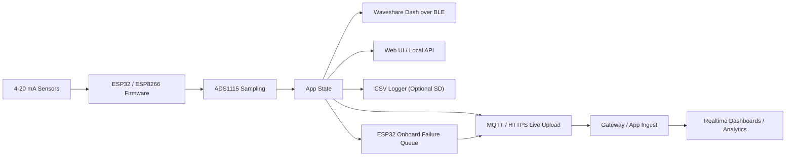

# Apexi Logger and Apexi Dash

Logger Dashboard, Diagnostics, Settings and System logs share the app's ApexiLabs mark and wordmark. The embedded logo works offline; Inter uses the app's Google Fonts stylesheet with a system-font fallback.

The dashboard CSV list displays file sizes in decimal MB to two decimal places.
Logger web sensor readings use two decimal places for pressure in bar and one for other units; this changes presentation only, not logged data or sensor accuracy.
Logger-to-Dash upload status reports snapshot acceptance separately from connection state: verified app acknowledgement for HTTPS, unconfirmed transport writes for MQTT. Older Dash firmware remains compatible.
TinyC6 store-and-forward uses the existing default `spiffs`-labelled partition as LittleFS; only wholly erased partitions are initialized automatically. Existing unmountable data is preserved. Upload diagnostics retain the HTTP status and server-acceptance age. The dashboard does not flag a healthy, recently acknowledged queue of up to two records as a fault; diagnostics still show the queue.
Owner-approved ESP32 credential provisioning and recovery are under coordinated implementation; see [device authorization](docs/device-authorization.md) for the draft contract and release gates.

ESP32 HTTPS capture/replay now uses a shared background worker and reusable same-origin connections; see [HTTPS replay](docs/https-replay.md) for queue ownership, throughput measurements and remaining batch-ingest work. ESP8266 remains synchronous.

System events are stored separately from sensor CSVs, with Dash forwarding,
an authenticated local viewer, and optional ESP32 HTTPS remote downloads.
See [System logs and remote downloads](docs/system-logs.md) for limits and setup.

Both firmware components live in `motorsport-data-acquisition` and share **Dash Link**, the BLE connection protocol.

| Component | PlatformIO target | Entry point |
| --- | --- | --- |
| Apexi Logger — TinyC6 | `logger-tinyc6` | `src/logger_main.cpp` |
| Apexi Logger — classic ESP32 | `logger-esp32` | `src/logger_main.cpp` |
| Apexi Logger — NodeMCU (legacy, no BLE) | `logger-nodemcuv2` | `src/logger_main.cpp` |
| Apexi Dash — Waveshare S3 1.28-inch | `dash-waveshare-s3-128` | `src/dash_main.cpp` |

These replace the previous `tinyc6`, `esp32dev`, `nodemcuv2`, and `waveshare_dash` environment names. The legacy OTA environment is now `logger-nodemcuv2-ota`. The default remains the NodeMCU logger; select the target explicitly for either ESP32 board.

Release assets use `apexi-<target>-firmware.bin`, `apexi-<target>-firmware.elf`, and, for ESP32 targets, `apexi-<target>-factory.bin`. BLE discovery identifies the logger as `APEXI-LOGGER` and the dash as `APEXI-DASH`. Existing `mda-logger` upstream identity, OTA hostname, and `mda-logger/1` handshake remain compatible. The dash status API now calls its handshake state `loggerReady`.

Arduino/PlatformIO firmware for a configurable 4-20 mA motorsport logger and its separate Waveshare ESP32-S3 round dash, targeting the Unexpected Maker TinyC6, classic ESP32 DevKit/WROOM-class boards, and the NodeMCU 1.0 / ESP-12E DevKit V2.

## Features
- Reads a configurable set of 4-20 mA sensors through an ADS1115-based analog front end
- Connects ESP32-family loggers to a Waveshare ESP32-S3-Touch-LCD-1.28 dash over BLE, retrying every five seconds when the dash is unavailable
- Builds separate `dash-waveshare-s3-128` firmware that shows the initial BLE connection state and serves its own commissioning web UI
- Logs CSV data to microSD with RTC timestamps when RTC hardware is fitted
- Serves a lightweight Wi-Fi dashboard and CSV download endpoints
- Publishes live telemetry over MQTT or authenticated HTTPS when station Wi-Fi and upstream settings are configured
- Buffers retryable HTTPS failures in a persistent circular onboard-flash queue on the 16 MB ESP32 target and replays them oldest-first after recovery
- Lights the NodeMCU built-in LED steadily once firmware setup begins
- Keeps pin mapping, sensor calibration, and refresh rates in one config file
- Synchronises the RV-3028 from NTP at every networked boot and hourly thereafter, while retaining RTC holdover when offline

## Required hardware

This project targets a NodeMCU 1.0 / ESP-12E DevKit V2 logger with external 4-20 mA receiver modules. The supported default uses a 0-8 bar pressure transmitter through a DFRobot SEN0262 into ADS1115 channel A0 and a 0-150 degrees Celsius temperature transmitter through a second SEN0262 into channel A1. Field transmitters are ordered for direct operation from the protected 12 V vehicle supply; the 24 V boost path is only a fallback when a transmitter cannot meet its loop compliance requirement at 12 V.

For the detailed BOM, pin table, wiring guidance, and commissioning steps, see [docs/hardware-setup.md](docs/hardware-setup.md).

Primary source files:
- board target: [`platformio.ini`](platformio.ini)
- pin map: [`include/PinDefinitions.h`](include/PinDefinitions.h)
- firmware feature defaults: [`include/AppConfig.h`](include/AppConfig.h)
- wiring and hardware details: [`docs/hardware-setup.md`](docs/hardware-setup.md)

## Project layout
- [`platformio.ini`](platformio.ini)
- [`include/AppConfig.h`](include/AppConfig.h)
- [`include/PinDefinitions.h`](include/PinDefinitions.h)
- [`include/LiveUpload.h`](include/LiveUpload.h)
- [`src/logger_main.cpp`](src/logger_main.cpp)
- [`src/LiveUpload.cpp`](src/LiveUpload.cpp)
- [`src/DashLink.cpp`](src/DashLink.cpp)
- [`src/dash_main.cpp`](src/dash_main.cpp)
- [`docs/hardware-setup.md`](docs/hardware-setup.md)
- [`docs/repo-contracts.md`](docs/repo-contracts.md)

## Build and flash
1. Install PlatformIO Core or use the PlatformIO VS Code extension.
2. Wire the NodeMCU, TinyC6, or classic ESP32 DevKit using the matching GPIO table in [`docs/hardware-setup.md`](docs/hardware-setup.md), then review [`include/PinDefinitions.h`](include/PinDefinitions.h).
3. Review sensor ranges, timing values, live upload settings, and optional hardware toggles in [`include/AppConfig.h`](include/AppConfig.h). Copy `include/AppSecrets.example.h` to the ignored `include/AppSecrets.h` and set Wi-Fi plus MQTT or HTTPS credentials there.
4. Run [`scripts/verify-repo.sh`](scripts/verify-repo.sh) `--fast` for host-side verification and contract checks, and `--full` when the local PlatformIO toolchain is available.
5. Build and upload the required environment with `pio run -e logger-tinyc6 -t upload --upload-port /dev/cu.usbmodem1101`, replacing the environment and port when needed.
6. Open the serial monitor at 115200 baud with `pio device monitor`. If a CH340-based board stays in reset, open the port with DTR and RTS inactive or press the board's `RST` button once.

### Waveshare dash firmware

Dash uses the app's ApexiLabs mark and Inter font (Google Fonts, with a system fallback offline). Header navigation opens the dedicated authenticated Settings view for LCD readings, refresh interval, colours, and alarms. Header time is explicitly browser time and zone, beside device uptime. Battery, OTA, and log-retention notes use expandable help tooltips; firmware updates occupy one grid column. Download human-readable, uptime-stamped troubleshooting records from `/api/diagnostics.log`; the JSON `/api/diagnostics` remains available for tools.

The small LCD prioritises one or two large readings. Hide either display slot for a single centred value; keep both active for two stacked values. Buffered rendering skips unchanged frames to avoid erase/redraw flicker. Sensor selection and refresh timing remain in the Dash web UI.

The gauge-inspired black face uses fixed-size, highlighted arcs that fade blue → green → yellow → red through per-sensor colour points. Fresh readings are white; stale/held values stay amber with muted arcs. Optional low/high thresholds produce a red alarm band only when fresh, valid readings breach an enabled limit. Configure colour points and alarm limits in Dash `/settings`; alarms start disabled. See [gauge configuration](docs/hardware-setup.md#configurable-gauge-colours-and-alarms).

The web UI pairs the native-size LCD preview with sensor readings in single-column cards on desktop, stacking them on mobile. Link status uses compact text; background polling leaves the manual refresh button visually stable.

The preview keeps only its live capture status and controls; sensor timing is summarised as the configured refresh interval and frequency.

Temperature readings are displayed as °C; the transport and saved-rule unit remains `C` for compatibility.
Gauge numerals use a slight italic slant with larger, upright units for readability on the 240-pixel display.
The coloured arcs extend to the screen edge without a separate outer border ring.
An active low/high alarm overrides only that sensor's arc and label to red; clearing the alarm restores its configured colour gradient.
Each arc is one solid band without an inset highlight seam. Dash pressure readings in bar use two decimals on the LCD and web UI, including held readings; temperature retains one decimal.
Dash's web UI also includes a Logger-style Battery & power card for its own 1S LiPo: GPIO1 voltage, approximate percentage and voltage trend. Unsupported USB power and charging rows are omitted. This is independent of Logger battery telemetry.
The small right-hand status dot reports Logger telemetry upload evidence: green for server-accepted snapshots, amber for unconfirmed MQTT sends, red for failed upload, grey for disabled/unknown/stale status. The web UI provides matching text. Both Logger and Dash need the optional upload-status protocol; see hardware setup for acknowledgement and freshness limits.
USB diagnostics identified a status-API stack overflow in the initial gauge build; the current diagnostic variant moves its JSON workspace to the heap. See the hardware setup notes for the bench results and remaining qualification.

Dash troubleshooting logging is enabled in RAM. Use **Dash Link → Download troubleshooting log** before reboot/OTA to save receive counters, sample gaps, and the latest 64 state transitions. See [diagnostic interpretation](docs/hardware-setup.md#dash-troubleshooting-log).

LCD and web readings hold the last valid number in amber during stale data, disconnection, or sensor faults, with an explicit status label. Held numbers are never marked live; a sensor with no valid history still shows no value. History resets on Dash reboot.

The **Live LCD** web card mirrors the actual 240×240 render buffer for remote layout checks. It downloads changed frames at most once per second, supports pause/resume and opening a snapshot, and marks retained images stale if Dash becomes unreachable. It shows rendered pixels, not a camera view of the physical panel.

Dash joins the station network from the ignored `include/AppSecrets.h`, keeping its recovery AP available. Its LCD uses a black background, and its live web UI matches Logger's theme. Password-protected OTA uses `APEXI_OTA_PASSWORD`; after the first USB installation, build Dash and run `./.venv/bin/python scripts/upload-dash-ota.py <dash-ip>`. See [Dash commissioning and OTA](docs/hardware-setup.md#waveshare-esp32-s3-dash) for setup, status fields, and network requirements.

Build and flash the separate dash image with:

```sh
pio run -e dash-waveshare-s3-128
pio run -e dash-waveshare-s3-128 -t upload --upload-port /dev/cu.usbmodem1101
```

PlatformIO writes an update image to `.pio/build/dash-waveshare-s3-128/firmware.bin` and a combined first-flash image to `.pio/build/dash-waveshare-s3-128/firmware.factory.bin`. On boot, the dash advertises the Apexi BLE service and creates the password-protected `APEXI-DASH` Wi-Fi access point. Join it with password `apexi-dash` and open `http://192.168.4.1` for the initial connection-status page. The logger firmware scans at boot and, while disconnected, retries using `AppConfig::kDashLink.retryIntervalMs` (five seconds by default). Logger also publishes sensor readings over BLE. Use Dash’s password-protected `/settings` page to choose the two LCD readings and set their refresh interval (250–5000 ms). Choices survive reboot; missing or faulted sensors show unavailable values.

## Wi-Fi firmware updates

The ESP8266 supports password-protected Arduino OTA updates while connected in station mode. Set a strong, unique `APEXI_OTA_PASSWORD` in the ignored `include/AppSecrets.h`; OTA remains locked when that value is empty. The local `/api/live` response reports `ota_enabled` and `ota_ready` so update availability can be checked without exposing the password.

The first OTA-capable firmware must be installed over USB. After that, build and upload on the same trusted network with the helper script, which reads the password from the ignored secrets header without printing it:

```sh
./scripts/upload-ota.sh mda-logger.local
```

An IP address can be supplied instead if `.local` discovery is unavailable. Do not commit the password or expose Arduino OTA beyond the trusted device network. OTA provides authenticated transfer, not transport encryption.

## Live streaming

The firmware includes a live telemetry publisher for near-real-time upload. MQTT remains the normal LAN transport. Set `APEXI_HTTPS_UPLOAD_ENABLED=1` to use the Access-protected HTTPS compatibility transport when the broker is not directly reachable. Configure the Cloudflare Access service-token pair and the scoped app device token only in the ignored `include/AppSecrets.h` created from [`include/AppSecrets.example.h`](include/AppSecrets.example.h). HTTPS validates the public certificate chain against ISRG Root X1; it never disables TLS verification.

The local dashboard separates connectivity, hardware, storage, and diagnostic state. It shows the active upstream endpoint, whether the server is connected, whether remote management is enabled locally, and the applied remote-configuration version. Open `/settings` to change the server host, port, live-upload enable flag, primary and secondary NTP servers, POSIX timezone rule, displayed timezone label, and the optional remote-management flag. The page uses HTTP Digest authentication with username `admin` and the device's OTA password. These settings are stored in a versioned, checksummed flash-backed EEPROM record and survive power loss. For HTTPS, the Cloudflare Access client ID and secret may be compiled from the ignored secrets header or replaced through write-only settings fields. Existing credential values are never returned in the page or API; leaving a field blank keeps the current value. Saving settings restarts the logger so the new endpoint, credentials, and clock configuration are applied cleanly.

Remote management is disabled by default. Enabling it locally requires live upload and displays a temporary pairing code with a refresh countdown on the authenticated settings page. The logger replaces that proof every ten minutes and immediately reports the replacement through its status heartbeat. Enter only the code in the app's shared device-pairing field; the app identifies the logger automatically. Management heartbeats include the effective live-upload flag, NTP servers, timezone rule, and timezone label so the app can initialise its form from the logger's current non-secret configuration. MQTT receives desired configuration from the device-scoped topic; HTTPS receives it in the authenticated status response. Desired documents use schema version 1, must match the authenticated device identity, carry a monotonically increasing configuration version, and contain the complete allow-listed configuration snapshot. Upstream host and credentials are deliberately excluded so a remote command cannot redirect or strand the logger.

The default clock configuration uses `pool.ntp.org`, `time.google.com`, POSIX timezone rule `AWST-8`, and display label `AWST`. The dashboard reports whether the RTC has been synchronised from NTP during the current boot, plus the last successful synchronization time. A valid RTC remains the offline holdover source between network synchronizations. POSIX offsets have reversed signs: for example, Perth is `AWST-8`, UTC is `UTC0`, and Sydney with daylight saving is `AEST-10AEDT,M10.1.0,M4.1.0/3`.

Dashboard uptime is displayed as `DD:HH:mm:ss`. The live API retains numeric `uptime_ms` for compatibility and also exposes the formatted value as `uptime`.

The ESP32 target uses the checked-in 16 MB partition table: two 2 MB OTA application slots plus an approximately 12 MB LittleFS partition. Store-and-forward is capped at 10 MB and split across two append-only segments; when capacity is exhausted, rotation drops the oldest remaining segment and reports the drop count. The asynchronous ESP32 path durably queues captures before upload, including when connected; flash endurance at the configured capture rate remains a production qualification requirement. The NodeMCU target keeps its existing 4 MB layout and does not enable this queue.

Production brokers require authentication. Set `APEXI_MQTT_USERNAME` to the same normalized value as `kLiveUpload.deviceId`; the broker ACL uses that identity to limit the device to publishing `<topicPrefix>/<deviceId>/live` and `<topicPrefix>/<deviceId>/status`. When remote management is enabled, it may additionally read only its own `<topicPrefix>/<deviceId>/config/desired` topic. Keep the matching password in the encrypted infrastructure vault and never commit `AppSecrets.h`.

Current behavior:
- The device publishes live sensor snapshots to MQTT on a fixed interval.
- Each message includes `schema_version`, a normalized `device_id`, a per-boot `session_id`, a monotonic `sequence`, the current timestamp, and the current sensor values.
- The retained MQTT status topic now reflects both online and offline state so downstream consumers do not keep stale liveness.
- The firmware exposes live upload state through the local web UI and `/api/live`.
- The ESP32 local UI exposes onboard queue readiness, pending records/bytes, drops, and queue errors.
- Local SD logging remains optional for long-duration/removable CSV archives.

### Starting and stopping a live session

There is no separate start-event command in the firmware. When `kFeatures.liveUploadEnabled` is `true` and station Wi-Fi/MQTT are configured, each device boot creates a new `<deviceId>-boot-<id>` session and starts publishing as soon as Wi-Fi and MQTT connect.

Before using the logger on track:

1. Confirm the local UI reports station Wi-Fi connected and either `MQTT LIVE` or `HTTPS LIVE`.
2. Check `/api/live` under `system` for `upload_enabled: true`, `upload_connected: true`, the expected `upload_session_id`, an increasing `upload_sequence`, and an empty `last_upload_error`.
3. Confirm the corresponding session appears in the telemetry app's **Ungrouped Sessions**, then attach it to the prepared event.

Powering down, losing Wi-Fi, or losing MQTT marks the stream offline through retained status or the MQTT last will. The telemetry app owns durable session finalization; the device does not finalize server-side data. Follow the telemetry app [Live Event Operations runbook](https://github.com/V5U2/motorsport-telemetry-app/blob/main/docs/live-events.md) for the complete race-day procedure.

Current limits:
- MQTT and Access-authenticated HTTPS emit the same versioned live/status payloads.
- ESP32 store-and-forward currently replays individual snapshots through the compatibility endpoint; server-side batch ingest remains a future throughput optimization.

Mermaid overview:



Recommended configuration model:
- Use authenticated HTTPS on the ESP32 when Cloudflare Access ingress is required.
- Use the onboard queue for transient connectivity recovery.
- Keep SD logging enabled only when long-term removable CSV archives are required.

Default MQTT topic layout:
- `<topicPrefix>/<deviceId>/live`
- `<topicPrefix>/<deviceId>/status`
- `<topicPrefix>/<deviceId>/config/desired` (retained, device-specific, opt-in read)

MQTT payload compatibility:
- Current live and status payloads use `schema_version: 1`.
- Version `1` keeps the existing live/status fields stable for deployed bridge and app consumers.
- Future incompatible payload changes must bump `Logic::kLivePayloadSchemaVersion`, update this README, and keep bridge tests accepting version `1` during rollout.

Example live payload shape:

```json
{
  "schema_version": 1,
  "device_id": "mda-logger",
  "session_id": "mda-logger-boot-42",
  "sequence": 12,
  "timestamp": "2026-04-05T02:15:30Z",
  "uptime_ms": 15234,
  "sensors": [
    {
      "id": "oil_pressure",
      "name": "Oil Pressure",
      "value": 4.812,
      "units": "bar",
      "loop_mA": 11.699,
      "fault": "none"
    }
  ]
}
```

## Host-side tests
- Run `./scripts/run-host-tests.sh` to execute hardware-independent logic tests on a desktop machine.
- These tests cover sensor current conversion, threshold faults, engineering-value clamping, filter behavior, RTC/fallback timestamp formatting, and log filename sanitization edge cases.
- GitHub Actions is configured to run the repo fast verification path on pushes and pull requests in [host-tests.yml](.github/workflows/host-tests.yml).

## Runtime controls
- Short press the UI button to switch between the main gauge screen and the diagnostics screen.
- Hold the UI button for 1.2 seconds to clear latched sensor faults.

## Web endpoints
The checked-in default is station mode. Create the ignored `include/AppSecrets.h` from the example and provide a 2.4 GHz SSID/password; `fast_connect`-style BSSID/channel pinning is not used, so the ESP8266 performs a normal network scan. If station association times out, firmware falls back to the open 2.4 GHz SoftAP `MDA-LOGGER` at `http://192.168.44.1` on channel 6. Set `AppConfig::kWifi.apPassword` to an 8+ character WPA2 key if a closed fallback AP is required.
- `/` compact phone-friendly sensor dashboard with a basic fault summary
- `/diagnostics` detailed connectivity, hardware, storage, transport, and sensor diagnostics, including Apexi Dash Bluetooth connection and link status. The upstream endpoint row displays only the server hostname; settings and `upload_server` retain the full endpoint. TinyC6 builds enable CSV logging to the stacked RTC Logger Shield microSD card (CS GPIO18).
- `/api/live` current readings and system state as JSON, including TinyC6 battery voltage with configurable calibration gain, estimated 1S LiPo percentage, USB/5V presence and voltage trend. Battery diagnostics are estimates, not a fuel gauge or definitive charging/completion status; see [hardware setup](docs/hardware-setup.md).
- `/api/files` available CSV files on the SD card
- `/download/<file>` fetch a CSV log file

The dashboard sizes sensor cards to their readings instead of stretching them across the page. Use the **Diagnostics** action beside **Settings**, or the fault-finding card, to open the full system view. The CSV card is visibly disabled and does not poll the file API when microSD logging is disabled in the firmware.
